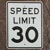

```{r setup, include=FALSE}
knitr::opts_chunk$set(echo = TRUE, message = FALSE, warning = FALSE)
```

# Aplicando nearest neighbors em R

```{r, eval = FALSE}
library(class)
pred <- knn(training_data, testing_data, training_labels)
```

# Exercício

## **Recognizing a road sign with kNN**

After several trips with a human behind the wheel, it is time for the self-driving car to attempt the test course alone.

As it begins to drive away, its camera captures the following image:


Can you apply a kNN classifier to help the car recognize this sign?

The dataset `signs` is loaded in your workspace along with the data frame `next_sign`, which holds the observation you want to classify.

```{r}
library(readr)
library(tidyverse)
knn_traffic_signs <- read_csv("data/knn_traffic_signs.csv")
signs <- knn_traffic_signs %>% 
  dplyr::filter(sample == "train") %>% 
  dplyr::select(sign_type, r1:b16)
next_sign <- knn_traffic_signs %>% 
  dplyr::filter(sample == "test") %>% 
  dplyr::select(sign_type, r1:b16)
glimpse(signs)
glimpse(next_sign)
```

-   Load the `class` package.

-   Create a vector of sign labels to use with kNN by extracting the column `sign_type` from `signs`.

-   Identify the `next_sign` using the `knn()` function.

    -   Set the `train` argument equal to the `signs` data frame *without* the first column.

    -   Set the `test` argument equal to the data frame `next_sign`.

    -   Use the vector of labels you created as the `cl` argument.

```{r}
# Load the 'class' package
library(class)

# Create a vector of labels
sign_types <- signs$sign_type

# Classify the next sign observed
knn(train = signs[-1], test = next_sign[-1], cl = sign_types)
```

## **Thinking like kNN**

With your help, the test car successfully identified the sign and stopped safely at the intersection.

How did the `knn()` function correctly classify the stop sign?

#### **Possible Answers**

-   It learned that stop signs are red

-   The sign was in some way similar to another stop sign **(CORRECT!!!)**

-   Stop signs have eight sides

-   The other types of signs were less likely

# **Exploring the traffic sign dataset**

To better understand how the `knn()` function was able to classify the stop sign, it may help to examine the training dataset it used.

Each previously observed street sign was divided into a 4x4 grid, and the red, green, and blue level for each of the 16 center pixels is recorded as illustrated here.

The result is a dataset that records the `sign_type` as well as 16 x 3 = 48 color properties of each sign.

##### 

-   Use the `str()` function to examine the `signs` dataset.

-   Use `table()` to count the number of observations of each sign type by passing it the column containing the labels.

-   Run the provided `aggregate()` command to see whether the average red level might vary by sign type.

```{r}
# Examine the structure of the signs dataset
str(signs)

# Count the number of signs of each type
table(signs$sign_type)

# Check r10's average red level by sign type
aggregate(r10 ~ sign_type, data = signs, mean)
```

# **Classifying a collection of road signs**

Now that the autonomous vehicle has successfully stopped on its own, your team feels confident allowing the car to continue the test course.

The test course includes 59 additional road signs divided into three types:

  

At the conclusion of the trial, you are asked to measure the car's overall performance at recognizing these signs.

The `class` package and the dataset `signs` are already loaded in your workspace. So is the data frame `test_signs`, which holds a set of observations you'll test your model on.

-   Classify the `test_signs` data using `knn()`.

    -   Set `train` equal to the observations in `signs` *without* labels.

    -   Use `test_signs` for the `test` argument, again without labels.

    -   For the `cl` argument, use the vector of labels provided for you.

-   Use `table()` to explore the classifier's performance at identifying the three sign types (the confusion matrix).

    -   Create the vector `signs_actual` by extracting the labels from `test_signs`.

    -   Pass the vector of predictions and the vector of actual signs to `table()` to cross tabulate them.

-   Compute the overall accuracy of the kNN learner using the `mean()` function.

```{r}
test_signs <- next_sign
```

```{r}
# Use kNN to identify the test road signs
sign_types <- signs$sign_type
signs_pred <- knn(train = signs[-1], test = test_signs[-1], cl = sign_types)

# Create a confusion matrix of the predicted versus actual values
signs_actual <- test_signs$sign_type
table(signs_pred, signs_actual)

# Compute the accuracy
mean(signs_pred == signs_actual)
```

# Understand the impact of 'k'

There is a complex relationship between k and classification accuracy. Bigger is not always better.

Which of these is a valid reason for keeping k as small as possible (but no smaller)?

**Possible Answers**

-   A smaller k requires less processing power

-   A smaller k reduces the impact of noisy data

-   A smaller k minimizes the chance of a tie vote

-   A smaller k may utilize more subtle patterns ✅

*Yes! With smaller neighborhoods, kNN can identify more subtle patterns in the data.*

# **Testing other 'k' values**

By default, the `knn()` function in the `class` package uses only the single nearest neighbor.

Setting a `k` parameter allows the algorithm to consider additional nearby neighbors. This enlarges the collection of neighbors which will vote on the predicted class.

Compare `k` values of 1, 7, and 15 to examine the impact on traffic sign classification accuracy.

The `class` package is already loaded in your workspace along with the datasets `signs`, `signs_test`, and `sign_types`. The object `signs_actual` holds the true values of the signs.

-   Compute the accuracy of the default `k = 1` model using the given code, then find the accuracy of the model using `mean()` to compare `signs_actual` and the model's predictions.

-   Modify the `knn()` function call by setting `k = 7` and again find accuracy value.

-   Revise the code once more by setting `k = 15`, plus find the accuracy value one more time.

```{r}
# Compute the accuracy of the baseline model (default k = 1)
k_1 <- knn(train = signs[-1], test = test_signs[-1], cl = sign_types)
mean(k_1 == signs_actual)

# Modify the above to set k = 7
k_7 <- knn(train = signs[-1], test = test_signs[-1], cl = sign_types, k = 7)
mean(k_7 == signs_actual)

# Set k = 15 and compare to the above
k_15 <- knn(train = signs[-1], test = test_signs[-1], cl = sign_types, k = 15)
mean(k_15 == signs_actual)
```

-   The highest accuracy was given by k = 7.

# **Seeing how the neighbors voted**

When multiple nearest neighbors hold a vote, it can sometimes be useful to examine whether the voters were unanimous or widely separated.

For example, knowing more about the voters' confidence in the classification could allow an autonomous vehicle to use caution in the case there is *any chance at all* that a stop sign is ahead.

In this exercise, you will learn how to obtain the voting results from the `knn()` function.

-   Build a kNN model with the `prob = TRUE` parameter to compute the vote proportions. Set `k = 7`.

-   Use the `attr()` function to obtain the vote proportions for the predicted class. These are stored in the attribute `"prob"`.

-   Examine the first several vote outcomes and percentages using the `head()` function to see how the confidence varies from sign to sign.

```{r}
# Use the prob parameter to get the proportion of votes for the winning class
sign_pred <- knn(train = signs[-1], test = test_signs[-1],
                cl = sign_types, k = 7, prob = TRUE)

# Get the "prob" attribute from the predicted classes
sign_prob <- attr(sign_pred, "prob")

# Examine the first several predictions
head(sign_pred)

# Examine the proportion of votes for the winning class
head(sign_prob)
```

# Data preparation for KNN

-   Assumes numeric data.

-   In our example, the road signs, each type of sign is represented by a matrix containing the pixels as RGB values.

-   KNN benefits from normalized data

## Normalizing data in R

```{r}
# define a min-max normalize() function
normalize <- function(x){
  return((x - min(x)) / (max(x) - min(x)))
}

# normalized version of r1
summary(normalize(signs$r1))
```

# **Why normalize data?**

Before applying kNN to a classification task, it is common practice to rescale the data using a technique like **min-max normalization**. What is the purpose of this step?

**Possible Answers**

-   To ensure all data elements may contribute equal shares to distance. ✅

-   To help the kNN algorithm converge on a solution faster.

-   To convert all of the data elements to numbers.

-   To redistribute the data as a normal bell curve.

*Rescaling reduces the influence of extreme values on KNN's distance function.*

\
